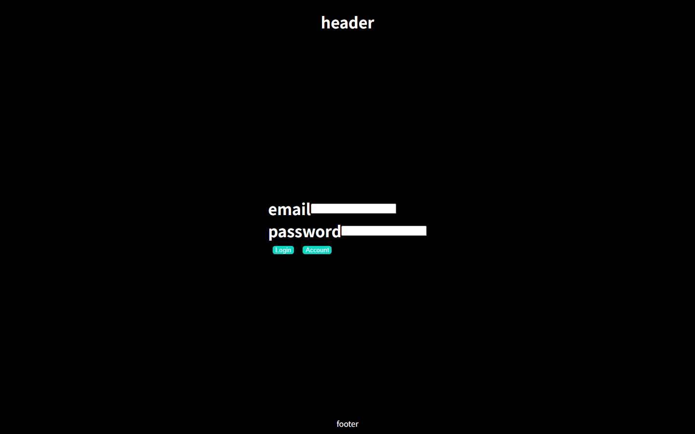
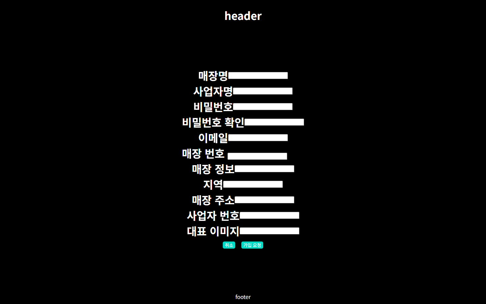
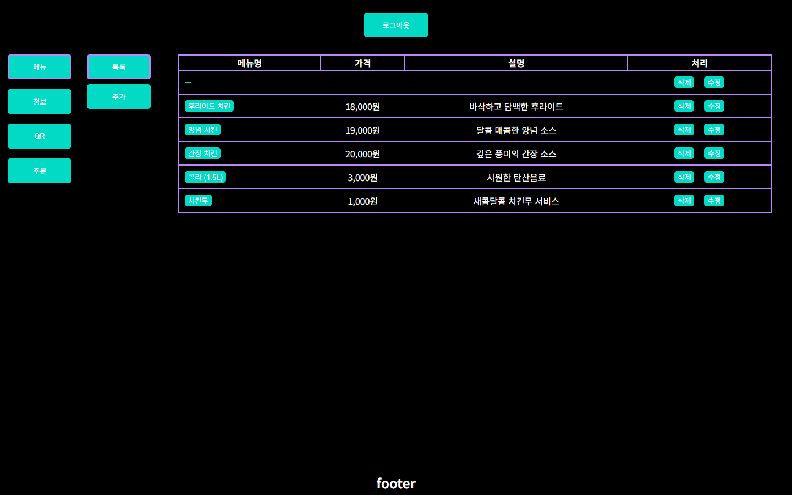
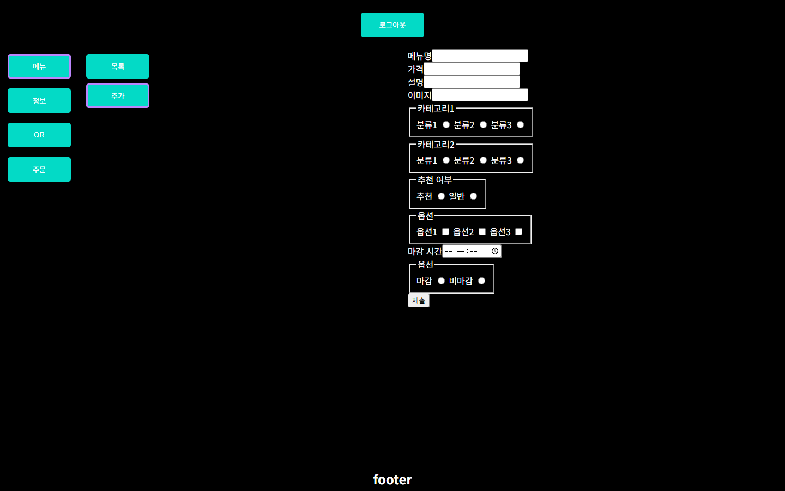
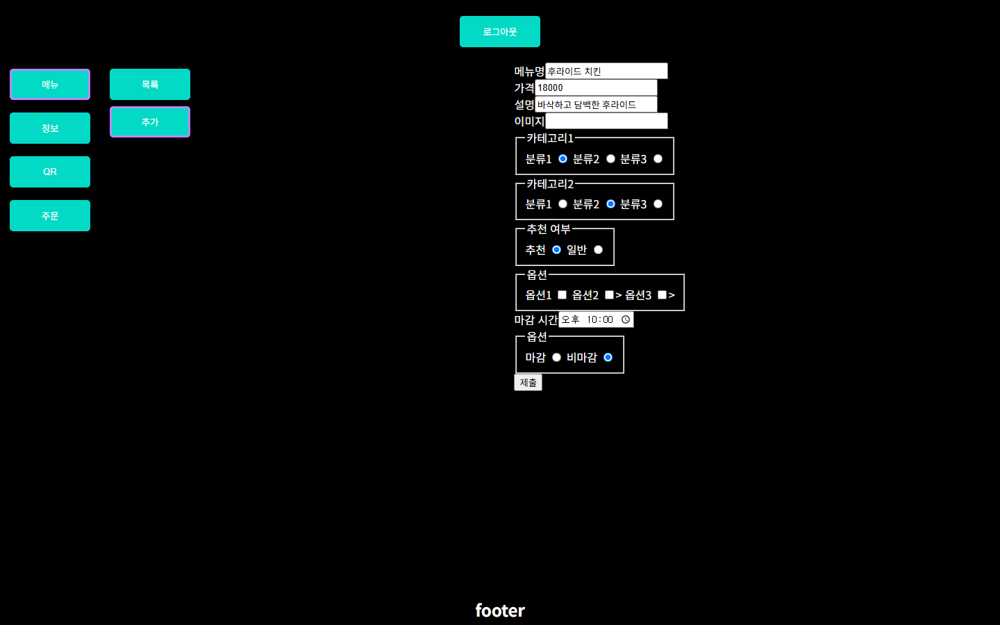
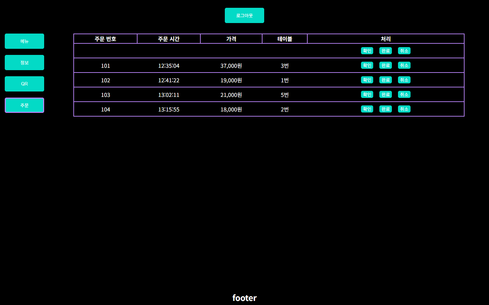
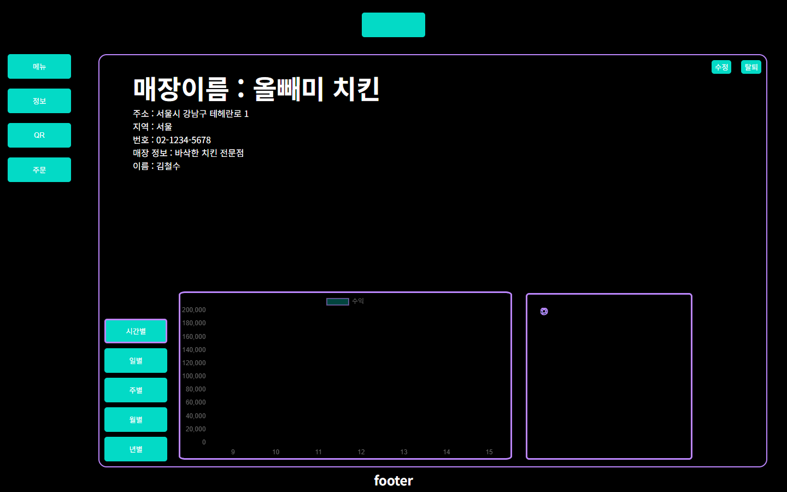
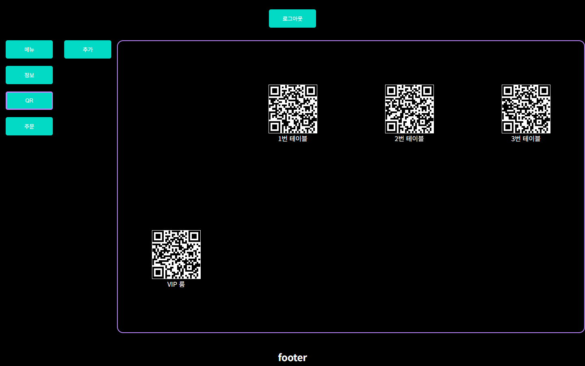
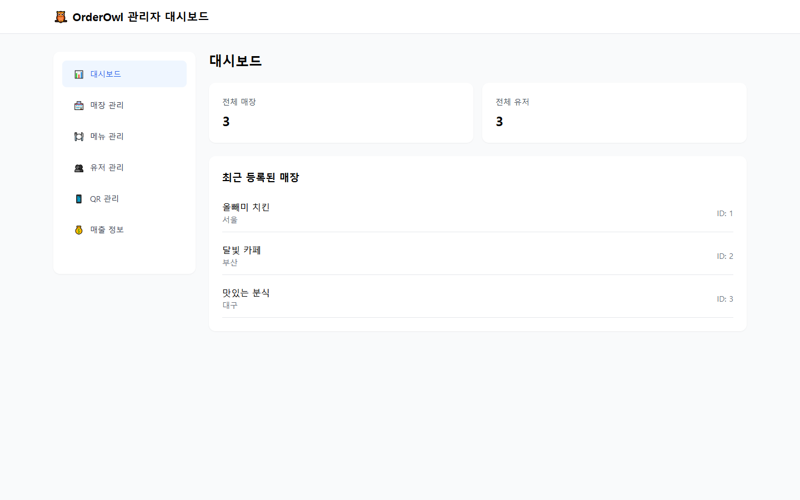

# 🦉 OrderOwl

QR 코드 기반 비대면 주문 시스템 — 손님이 테이블의 QR 코드를 스캔하면 해당 매장의 메뉴판이 열리고, 바로 주문까지 이어지는 웹 애플리케이션입니다.

---

## 목차

- [프로젝트 개요](#프로젝트-개요)
- [기술 스택](#기술-스택)
- [프로젝트 구조](#프로젝트-구조)
- [주요 기능](#주요-기능)
- [화면 구성](#화면-구성)
- [DB 스키마 요약](#db-스키마-요약)
- [실행 방법](#실행-방법)

---

## 프로젝트 개요

| 항목 | 내용 |
|------|------|
| 분류 | 팀 프로젝트 |
| 유형 | Java 웹 애플리케이션 (JSP / Servlet) |
| 서버 | Apache Tomcat 10.1 |
| DB | MySQL (JNDI DataSource) |
| 빌드 | Eclipse Dynamic Web Project |

---

## 기술 스택

**Backend**
- Java 17+
- Jakarta EE 6.0 (Servlet, JSP, JSTL)
- Apache Tomcat 10.1
- MySQL + JNDI Connection Pool

**Frontend**
- JSP + JSTL
- CSS3 (Grid · Flexbox)
- JavaScript (Vanilla JS / jQuery)
- Chart.js (매출 그래프)
- Tailwind CSS (관리자 대시보드)
- Google ZXing / QR Server API (QR 생성)

---

## 프로젝트 구조

```
OrderOwl/
├── resources/
│   ├── actionMapping.properties   # URL → Controller 매핑
│   └── dbQuery.properties         # SQL 쿼리 모음
└── src/main/
    ├── java/
    │   ├── controller/
    │   │   ├── common/            # DispatcherServlet, Controller 인터페이스
    │   │   ├── admin/             # AdminController
    │   │   ├── customer/          # MenuController, OrderController
    │   │   └── user/              # UserController
    │   ├── dao/
    │   │   ├── AdminDAO.java
    │   │   ├── customer/          # MenuDAO, OrderDAO
    │   │   └── user/              # UserDAO
    │   ├── dto/                   # CategoryDTO, MenuDTO, OrderDTO …
    │   ├── service/               # AdminService, UserService, MenuService …
    │   ├── listener/              # HandlerMappingListener (URL 맵 초기화)
    │   └── util/
    │       └── DbUtil.java        # JNDI DataSource 유틸
    └── webapp/
        ├── index.jsp              # 고객 주문 진입점 (QR 스캔 후 도착)
        ├── adminDashboard.jsp     # 관리자 대시보드
        ├── index_user.jsp
        └── user/
            ├── auth/              # 로그인 / 회원가입
            ├── menu/              # 메뉴 목록 / 추가 / 수정
            ├── order/             # 주문 접수 · 관리
            ├── inform/            # 매장 정보 · 매출 통계
            └── qr/                # QR 코드 생성 · 관리
```

---

## 주요 기능

### 고객 (Customer)
- QR 코드 스캔 → 해당 테이블 메뉴판 자동 진입
- 카테고리별 메뉴 조회
- 장바구니 담기 및 주문 전송

### 업주 (User)
- 이메일/비밀번호 로그인 · 회원가입
- 메뉴 등록 / 수정 / 삭제
- 실시간 주문 접수 (완료 · 취소 처리)
- 매출 통계 시각화 (시간별 · 일별 · 주별 · 월별 · 연별)
- 테이블별 QR 코드 생성 · 다운로드

### 관리자 (Admin)
- 전체 매장 · 유저 · 메뉴 조회 및 관리
- 매장별 매출 조회 (기간 필터)
- 강제 회원 탈퇴

---

## 화면 구성

### 업주 화면

| 화면 | 설명 |
|------|------|
|  | **로그인** — 업주 이메일/비밀번호 로그인 |
|  | **회원가입** — 매장명·주소·연락처 등 가입 정보 등록 |
|  | **메뉴 목록** — 등록된 메뉴 조회, 수정/삭제 |
|  | **메뉴 추가** — 카테고리·가격·옵션·이미지 등록 |
|  | **메뉴 수정** — 기존 메뉴 정보 수정 |
|  | **주문 관리** — 실시간 주문 접수·완료·취소 처리 |
|  | **매장 정보 & 매출 통계** — 매장 정보 및 Chart.js 시간별/일별/주별 매출 그래프 |
|  | **QR 코드 관리** — 테이블별 QR 코드 생성·다운로드 |

### 관리자 화면

| 화면 | 설명 |
|------|------|
|  | **관리자 대시보드** — 전체 매장·유저 현황, 매장별 메뉴·매출 관리, 강제 탈퇴 |

### 고객 화면

| 화면 | 설명 |
|------|------|
|  | **고객 주문 페이지** — QR 코드 스캔 후 진입, 메뉴 조회 및 주문 |

---

## DB 스키마 요약

```sql
User          -- 업주 계정 (user_id, username, email, password, role)
Store         -- 매장 정보 (store_id, owner_id FK, store_name, region, …)
Menu          -- 메뉴      (menu_id, store_id FK, menu_name, price, category1_code, …)
StoreTable    -- 매장 테이블 (table_id, store_id FK, table_no)
QRCode        -- QR 코드   (qrcode_id, table_id FK, qrcode_data, qr_img_src)
OrderTable    -- 주문      (order_id, table_id FK, store_id FK, total_price, status, …)
OrderDetail   -- 주문 상세 (order_detail_id, order_id FK, menu_id FK, quantity, price)
Payment       -- 결제      (payment_id, order_id FK, payment_status, …)
```

---

## 실행 방법

### 사전 요구사항

| 도구 | 버전 |
|------|------|
| Java JDK | 17 이상 |
| Apache Tomcat | 10.1 |
| MySQL | 8.0 이상 |

### 1. DB 설정

```sql
-- MySQL에서 스키마 생성 후 위 테이블 DDL 실행
CREATE DATABASE orderowl CHARACTER SET utf8mb4;
```

### 2. Tomcat JNDI 설정 (`context.xml`)

```xml
<Resource name="jdbc/mySql"
          auth="Container"
          type="javax.sql.DataSource"
          driverClassName="com.mysql.cj.jdbc.Driver"
          url="jdbc:mysql://localhost:3306/orderowl?serverTimezone=Asia/Seoul"
          username="root"
          password="your_password"
          maxActive="20" maxIdle="10" maxWait="-1"/>
```

### 3. WEB-INF/lib 필요 JAR

- `mysql-connector-j-8.x.jar`
- `jakarta.servlet.jsp.jstl-3.x.jar`
- `jakarta.servlet.jsp.jstl-api-3.x.jar`

### 4. Eclipse에서 실행

1. `File > Import > Existing Projects into Workspace`로 `OrderOwl` 폴더 임포트
2. Project Properties → Targeted Runtimes → Apache Tomcat 10.1 선택
3. `Run As > Run on Server`

### 5. 프론트엔드 미리보기 (백엔드 없이)

Python이 설치된 경우 정적 HTML 프리뷰 서버를 실행할 수 있습니다.

```bash
python preview_server.py
# → http://localhost:8888/user/auth/login/login.html
```

---


